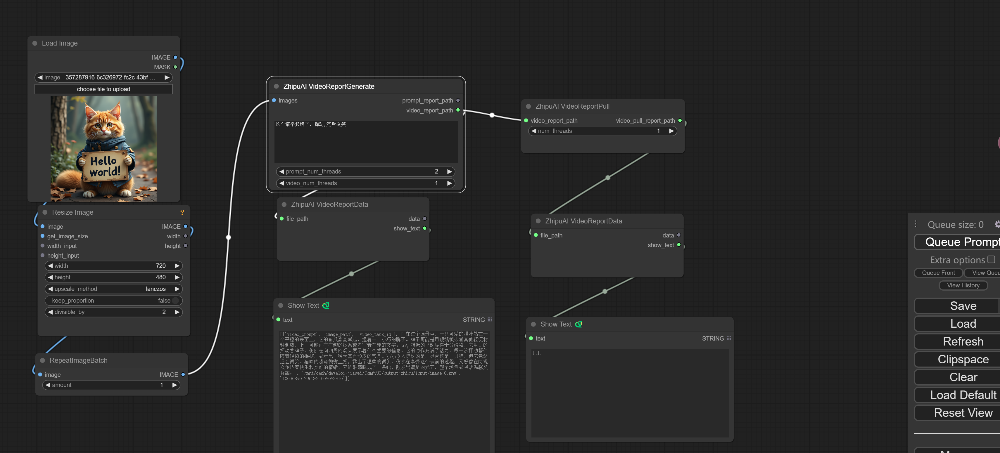
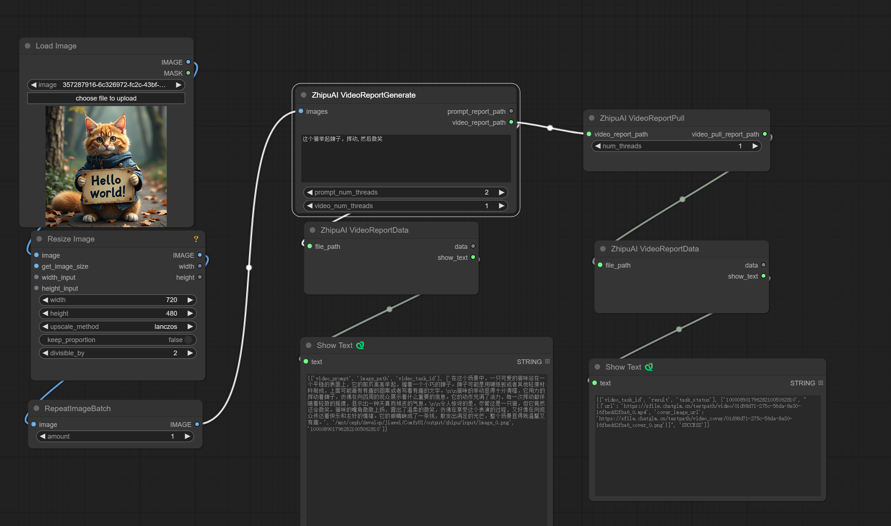

### 介绍
智谱平台生成工作流，继承ComfyUI插件

### 使用

视频生成： 示例工作流文件`example/zhipuai_cogvideo_workflow.json`

> 说明：这个示例演示了cogvideox的视频生成功能，基于`https://github.com/glide-the/zhipuai-platform-video`设计
> 由于平台是异步设计，结果有可能等待几分钟返回，这个工作流设计了幂等缓存机制，同一个提示词可以多次尝试获取结果，

- 第一次运行状态

- 成功示例

